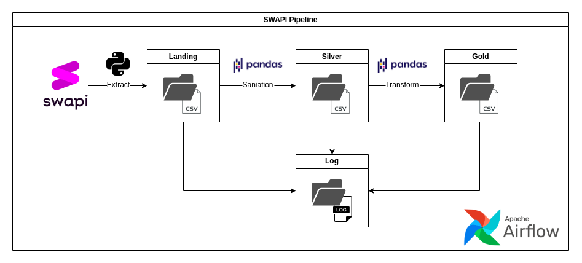

## Projeto DataOps

- [Projeto DataOps](#projeto-dataops)
- [Introdução](#introdução)
- [Requisitos](#requisitos)
- [Arquitetura do projeto](#arquitetura-do-projeto)
  - [Extração](#extração)
  - [Sanitização](#sanitização)
  - [Transformação e Disponibiliade](#transformação-e-disponibiliade)
  - [Orquestração](#orquestração)
- [Origem dos dados](#origem-dos-dados)
- [Como executar o projeto](#como-executar-o-projeto)
- [Contribuidores](#contribuidores)

## Introdução

Projeto desenvolvido para avaliação final da disciplina DataOps, ministrada no curso de MBA em Engenharia de Dados turma 03 (2023-2024), oferecida pela Faculdade Impacta de Tecnologia.

O projeto consite em obter dados da API “SWAPI — the Star Wars API” e gerar um arquivo .csv com os dados relativos a características do personagem, seu planeta natal e os filmes em que ele/ela participou.

A API SWAPI refere-se ao universo de Star Wars, maior franquia da cultura pop de todos os tempos, e traz dados relativos a Planetas, Naves Espaciais, Veículos, Pessoas (no nosso caso adotamos o conceito de Personagem), Filmes e Espécies. Todo o conteúdo do site em que a API está hospedada está em inglês, logo as bases estão denominadas no original como Planets, Spaceships, Vehicles, People, Films and Species.

Para esse projeto consumimos dados apenas das fontes Planets, People e Films, onde em Planetas temos informações sobre os planetas do universo Star Wars, em Personagens temos os detalhes sobre os personagens da saga, e em Filmes temos os dados relacionados aos filmes da franquia Star Wars.

Cabe ressalatar que o aplicativo abrange apenas os 6 primeiros filmes da saga, não expandindo para os conteúdos derivados em séries, livros, quadrinhos e jogos. Os filmes cobertos pelos dados da API são: Episódio I: A Ameaça Fantasma (1999); Episódio II: Ataque dos Clones (2002); Episódio III: A Vingança dos Sith (2005); Episódio IV: Uma Nova Esperança (1977); Episódio V: O Império Contra-Ataca (1980); Episódio VI: O Retorno de Jedi (1983).

Apesar da aplicação informar em sua página inicial que inclui dados de 7 filmes de Star Wars, contando também com os dados de O Despertar da Força, isso não se configurou quando realizamos a validação dos dados.

## Requisitos

  Os requisitos levantados e definidos para a concepção desse projeto estão a seguir em formato de tópicos para melhor visualização dos pontos que devem ser cobertos:

- [x] Formato da tabela de entrega: csv
- [x] Frequência de atualização do dado: frequência de 1x por dia
- [x] Parâmetro de coleta: 1 página por requisição
- [x] Salvar logs do processo
- [x] Armazenamento dos dados brutos
- [x] Armazenamento dos dados saneados:
  - [x] Tratamento de tipos
  - [x] Tratamento de nomes
  - [x] Tratamento de nulos
  - [x] Armazenamento dos dados agregados e tratados
- [x] Validação de qualidade de dados:
  - [X] Validação de duplicados
  - [x] Tolerância de nulos

## Arquitetura do projeto



### Extração

  Para extração dos dados foi utilizado a biblioteca HTTPX, com o objetivo de realizar requisições HTTP de forma assíncrona. Utilizamos um parâmetro de coleta que se traduz em uma página por requisição, otimizando a eficiência do processo de ETL. Todos os dados brutos encontram-se armazenados na pasta [data/swapi](silver), preservando sua integridade original.
  
### Sanitização

  A sanitização dos dados foi realizada utilizando a biblioteca Pandas para garantir que os dados estejam limpos e prontos para análises avançadas. Foram realizados processos como remoção de caracteres especiais, conversão de tipos, remoção de valores nulos, etc, baseando-se nos arquivos de configuração encontrados na pasta [meta](airflow/dags/swapi/meta). Os dados sanitizados de cada base encontram-se salvos separadamente na pasta [data/swapi](landing)

### Transformação e Disponibiliade

  Após sanitizados, os dados foram transformados e agrupados em um único arquivo .csv para que possa ser consumido por outras aplicações. Os dados sanitizados de cada base encontram-se salvos separadamente na pasta [data/swapi](gold). Todas as configurações estão disponiveis na pasta [meta](airflow/dags/swapi/meta).

### Orquestração

  Para a orquestração do projeto foi utilizada a ferramenta Airflow, com o objetivo de realizar a criação, agendamento das tarefas e monitoramento das mesmas. As tarefas (DAGs) foram construídas de forma a desencadear uma sequência de processos para a execução do pipeline de dados, garantindo que toda sua execução seja registrada, possibilitando localização precisa da ação caso tenha ocorrido algum erro no processo. As configurações realizadas nessa etapa encontram-se na pasta [dags](airflow/dags/swapi).

## Origem dos dados

  Os dados utilizados para a execução desse projeto foram extraídos das fontes:
  
- People, disponível na URL: <https://swapi.dev/api/people/>?
- Planets, disponível na URL: <https://swapi.dev/api/planets/>?
- Films, disponível na URL: <https://swapi.dev/api/films/>?

## Como executar o projeto

Para executar o projeto é necessário ter as ferramentas Docker e Docker Compose instaladas na máquina.

1. Clone o projeto.

2. Execute o build da imagem do Airflow customizada com as bibliotecas necessarias para o projeto:

```bash
docker build -t custom-airflow:2.7.2 -f ./Dockerfile.airflow .   
```

3. Preencha as variáveis de ambiente necessarias no arquivo .env .

4. Configure o projeto com o comando abaixo.

```bash
docker compose up airflow-init   
```

5. Inicie o projeto com o comando abaixo.

```bash
docker compose up
```

6. Acesse o Airflow em <http://localhost:8080>.

## Contribuidores

<div class="tg-wrap"><table>
<tbody>
  <tr>
    <td><a href="https://github.com/Ruy-Araujo">

<br />
<sub><b>Ruy Araujo</b></sub></a>
<br />
</td>
    <td><a href="https://github.com/icaloooou">

<br />
<sub><b>Ingrid Calou Batista</b></sub></a>
<br /></td>
    <td><a href="https://github.com/GiselePSouza">

<br />
<sub><b>Gisele Souza</b></sub></a>
<br /></td>
    <td><a href="https://github.com/ElPablitoBR">

<br />
<sub><b>Pablo Batista</b></sub></a>
<br />
</td>
    <td><a href="https://github.com/moninegrao">

<br />
<sub><b>Monise Negrão</b></sub></a>
<br /></td>
  </tr>
</tbody>
</table></div>
